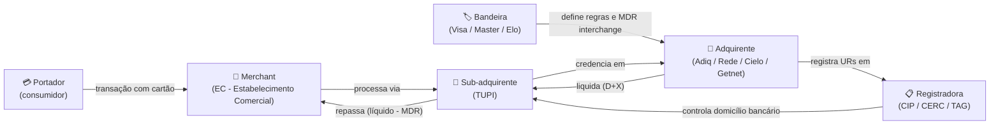
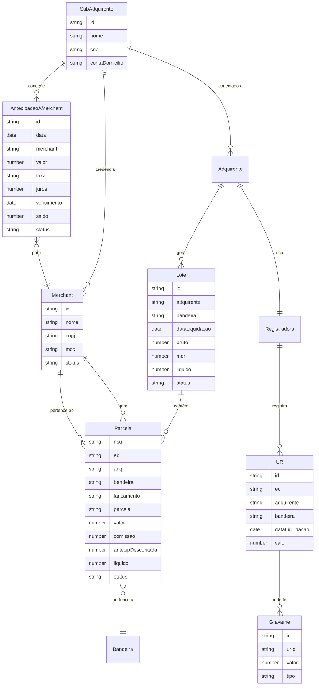

# DOMAIN — Glossário e Regras de Negócio Fintech

Documentação do domínio de pagamentos aplicado ao Yby Front (backoffice de sub-adquirente). Extraído do código-fonte e comentários inline dos componentes.

---

## Glossário Fintech

### 1. Sub-adquirente
Empresa intermediária que processa pagamentos em nome de merchants, sem ter credenciamento direto com as bandeiras. Conecta-se a um ou mais adquirentes licenciados (Adiq, Rede, Cielo, Getnet). Na UI aparece como: badge "Sub-adquirente" no GlobalHeader e em `/login`, identificação "TUPI — Sub-adquirente".

### 2. Adquirente (Acquirer)
Instituição financeira licenciada pelas bandeiras para processar transações. No sistema: Adiq, Rede, Cielo, Getnet. Aparece nos campos `adq` de todas as tabelas, em `BrandLogo` e nos domicílios bancários da aba Liquidações.

### 3. Merchant / EC (Estabelecimento Comercial)
Loja ou empresa que aceita pagamentos via cartão. Identificado por CNPJ e MCC. Na UI: lista em `/merchants`, campo `ec` nas tabelas de parcelas, campo `merchant` nas antecipações.

### 4. Bandeira (Card Scheme / Arranjo)
Rede de pagamento que define regras de operação: Visa, Mastercard, Elo, Amex. Na UI: coluna "Bandeira" / "Arranjo" nas tabelas, `BrandLogo`, e eje da tabela de pricing.

### 5. MDR (Merchant Discount Rate)
Taxa percentual cobrada sobre cada transação, retida pelo sub-adquirente. É a principal fonte de receita do sub. Na UI: coluna "MDR retido" em amarela/vermelha nas tabelas de parcelas, tooltip: "MDR (Merchant Discount Rate): taxa percentual cobrada pelo adquirente por cada transação processada." Configurado na página de Pricing.

### 6. Parcela / Installment
Fração de uma venda parcelada. Cada parcela tem data de crédito própria e NSU compartilhado. Representada como `"2/6"` (parcela 2 de 6). Na UI: coluna "Parcela" na aba "Por parcela" da Agenda.

### 7. NSU (Número Sequencial Único)
Identificador único de uma transação originada no terminal. Múltiplas parcelas da mesma venda compartilham o mesmo NSU. Na UI: coluna "NSU / Ref." em Roboto Mono.

### 8. Lote (Batch)
Agrupamento de transações liquidadas em um mesmo dia por adquirente e bandeira. Identificado por código `L-XXX`. Na UI: aba "Por lote" da Agenda, aba "Liquidações" do Financeiro.

### 9. Liquidação (Settlement)
Crédito efetivo do valor processado na conta do sub-adquirente, realizado pelo adquirente. Ocorre após o prazo regulatório. Na UI: aba "Liquidações" do Financeiro, status "Liquidado" em Tags.

### 10. Domicílio Bancário
Conta corrente cadastrada junto à registradora para receber os créditos dos adquirentes. Cada adquirente pode ter domicílio diferente. Na UI: coluna "Domicílio bancário" na tabela de domicílios em `/financial` (aba Liquidações), campo "Conta creditada" nos eventos de liquidação.

### 11. Registradora
Infraestrutura regulatória que registra e controla os recebíveis de cartão (URs). Exemplos: CIP, CERC, TAG. Regulação: Banco Central (Resolução BCB 96/2021). Na UI: coluna "Registradora" na tabela de domicílios.

### 12. UR (Unidade de Recebível)
Contrato de recebível registrado na registradora, vinculado ao par EC + Adquirente + Bandeira + Data de liquidação. Aparece nos diagramas de entidade (ver abaixo) e nos comentários de código da aba Funding.

### 13. Gravame / Oneração
Retenção de recebíveis como garantia de uma operação de crédito (ex: empréstimo tomado pelo EC). Bloqueia parte do crédito do dia. Na UI: linha "↳ Gravame / oneração" no painel de detalhe do dia em `/agenda` (aba Calendário), KPI "Gravames ativos" em `/financial`.

### 14. Antecipação Tomada
Adiantamento dos recebíveis do sub-adquirente junto ao adquirente. O sub recebe antes do prazo mas assume dívida que é descontada automaticamente nos próximos créditos. Distinto da antecipação concedida a ECs. Na UI: coluna "Antecip. tomada" nas tabelas, tooltip: "Valor total da operação de antecipação que cobre esta parcela. Quando liquidada, o crédito abate este saldo junto ao adquirente."

### 15. Antecipação a Merchants (AEC)
Crédito concedido pelo sub-adquirente ao EC, adiantando os recebíveis futuros. O sub adianta o valor e recupera via desconto nos próximos repasses. Receita = juros cobrados. Na UI: aba "Antecipações" em `/agenda` e `/financial`, status `Em aberto` / `Quitado` / `Recuperado` / `A recuperar`.

### 16. Repasse / Pagamento a Merchant
Transferência do valor líquido (bruto - MDR) do sub para a conta do EC após liquidação. Na UI: aba "Pagamentos" em `/agenda`, coluna "Valor repassado".

### 17. Funding
Crédito global recebido dos adquirentes. O "funding" cobre o total liquidado (após deduções de antecipações tomadas e MDR). Na UI: aba "Funding / Liquidação" em `/agenda`, KPI "Float do sub-adquirente".

### 18. Float do Sub-adquirente
Saldo em trânsito — diferença entre o que foi creditado pelos adquirentes e o que foi repassado aos ECs. Na UI: KPI em `/agenda` (aba Funding) e `/financial` (aba Extrato, "Saldo disponível: R$ 78.328,00").

### 19. Rolling Reserve
Percentual retido de cada repasse como reserva operacional de segurança, liberado após prazo. Na UI: card fixo em `/agenda` (aba Pagamentos): "3% · libera em 90d", valor R$ 43.200,00.

### 20. MCC (Merchant Category Code)
Código de 4 dígitos que classifica o tipo de negócio do EC, segundo padrão ISO 18245. Afeta taxas de MDR. Na UI: coluna "MCC" em `/merchants`, campo "MCC" no drawer de detalhe, select de MCC na simulação de antecipação.

---

## Diagrama: Fluxo Financeiro



---

## Diagrama: Entidades do Sistema



---

## Regras de Negócio Extraídas do Código

### Cálculo do valor líquido de parcela

```
liquido = valor - comissao
```

O campo `comissao` representa o MDR retido. Se a parcela foi antecipada, o campo `antecipDescontada` indica o valor total da operação de antecipação que cobre a parcela (para fins de exibição), mas o `liquido` já está calculado.

### Deduplicação de antecipação por NSU

Para evitar double-count ao somar o total antecipado, o código deduplicação no cálculo de KPIs:

```ts
const seen: Record<string, number> = {}
kpiData.forEach(r => {
  if (r.antecipado && r.antecipDescontada > 0)
    seen[r.nsu] = Math.max(seen[r.nsu] || 0, r.antecipDescontada)
})
const totalAntecip = Object.values(seen).reduce((s, v) => s + v, 0)
```

### Status de lote derivado das parcelas

```ts
const allPago = lote.rows.every(r => r.status === 'Pago')
const loteStatus = lote.antecipDescontada > 0 ? 'Antecipado' : allPago ? 'Liquidado' : 'Pendente'
```

Lote é "Antecipado" se qualquer antecipação foi descontada; "Liquidado" se todas as parcelas foram pagas; "Pendente" caso contrário.

### Fluxo de caixa do sub-adquirente (demonstrativo Funding)

```
(+) Total bruto das vendas:               R$ 1.240.500
(-) Antecipações tomadas (saldo devedor): R$ 140.000
(-) MDR e tarifas:                        R$ 29.772
(-) Chargebacks e cancelamentos:          R$ 12.400
(=) Líquido disponível para crédito:      R$ 1.058.328
(-) Pagamentos a merchants:               R$ 980.000
(=) Saldo do sub-adquirente (float):      R$ 78.328
```

### Simulação de antecipação

```ts
const repasseEC  = -(v * (1 - taxaEC))
const custoAdq   = -(v * taxaAdq)
const liquido    = v + repasseEC + custoAdq
// liquido = v * (taxaEC - taxaAdq)
// Ex: v=1000, taxaEC=2%, taxaAdq=1% → liquido = 1000 * 0.01 = R$ 10,00
```

### Status de dias do calendário

```ts
const status =
  day % 5 === 0 && past ? 'antecipado' :
  day < 19 ? 'creditado' :
  day < 22 ? 'confirmado' :
  'previsto'
```

- `creditado`: passado confirmado em conta
- `confirmado`: agendado, ainda não creditado
- `antecipado`: crédito já recebido via antecipação
- `previsto`: data futura

### Tag fallback

Qualquer `status` não mapeado no `STATUS_MAP` do componente `Tag` faz fallback para o estilo de "Pendente" (amarelo). Não lança erro.

---

## Prazos Regulatórios Mencionados no Código

| Prazo | Evento | Fonte |
|-------|--------|-------|
| D+1 útil | Liquidação de débito e PIX | Banner de política de repasse em `/agenda` (aba Pagamentos) |
| D+14 | Liquidação de crédito à vista | Banner de política de repasse |
| D+30/parcela | Liquidação de crédito parcelado | Banner de política de repasse |
| 30 dias | Prazo padrão de antecipação a merchants | Campo `prazo: '30d'` nos dados de antecipação |
| 90 dias | Prazo de liberação da rolling reserve | Card de reserva em `/agenda` (aba Pagamentos): "libera em 90d" |

---

## Registradoras no Sistema

| Sigla | Adquirente associado (mock) |
|-------|-----------------------------|
| CIP | Adiq, Getnet |
| CERC | Rede |
| TAG | Cielo |
